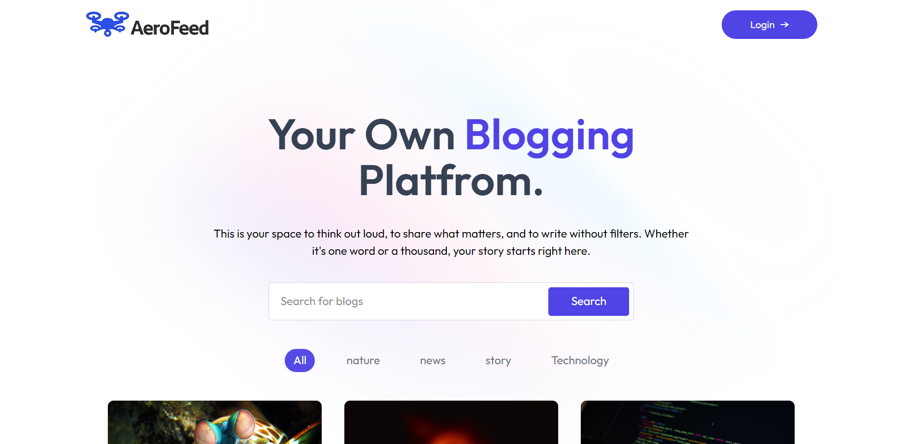

----
<div align="center">
  

  # AeroFeed

  A sleek and modern blogging platform built with React and Strapi, featuring a clean UI, dark mode, and a powerful admin panel.

  <!-- Badges -->
  <p>
    
    
    
    
  </p>

  **Live Demo**
</div>

---

## 📋 Table of Contents

- About The Project
- Key Features
- Built With
- Getting Started
  - Prerequisites
  - Installation
- Usage
- Project Structure
- Contributing
- License
- Contact

---

## 📖 About The Project

AeroFeed is a beautifully designed blogging platform that provides an exceptional reading experience. The frontend is built with React and Tailwind CSS, making it fast, responsive, and easy to customize. Content is seamlessly managed through Strapi, a leading open-source headless CMS, which provides a powerful and intuitive admin panel for content creators.

!AeroFeed Screenshot



---

## ✨ Key Features

- **Modern & Clean UI:** Aesthetically pleasing design for an enjoyable reading experience.
- **Fully Responsive:** Adapts to all screen sizes, from mobile to desktop.
- **Dynamic Content:** Powered by the Strapi headless CMS for easy content management.
- **Admin Panel:** A dedicated dashboard for creating, editing, and managing blog posts.
- **Blog Search:** (Coming Soon) Functionality to search for posts.

---

## 🛠️ Built With

This project was built using the following technologies:

| Tech | Category |
|---|---|
| **React** | Frontend Library |
| **React Router** | Frontend Routing |
| **Tailwind CSS** | CSS Framework |
| **Strapi** | Headless CMS (Backend) |
| **Node.js** | Backend Runtime |

---

## 🚀 Getting Started

Follow these instructions to set up the project on your local machine.

### Prerequisites

Make sure you have the following installed:
- Node.js (v18 or later)
- `npm` or `yarn`

### Installation

1.  **Clone the repository:**
    ```bash
    git clone <your-repository-url>
    cd <your-repository-folder>
    ```

2.  **Set up the Backend (Strapi):**
    ```bash
    # Navigate to the backend directory (or create one)
    cd backend

    # Install dependencies and run the server
    npm install
    npm run develop
    ```
    - Open `http://localhost:1337/admin` to create an admin user and your content types (e.g., a "Blog" collection with fields like `title`, `content`, etc.).
    - In `Settings > Roles > Public`, grant `find` and `findOne` permissions for your content types.

3.  **Set up the Frontend (React):**
    ```bash
    # Navigate to the frontend directory from the root
    cd frontend

    # Install dependencies
    npm install

    # Run the development server
    npm run dev
    ```
    - Your React app will be available at `http://localhost:5173`.

---

## 🖥️ Usage

After setting up the project:
1.  **Create Posts:** Log in to the Strapi admin panel at `http://localhost:1337/admin` and start creating your blog posts.
2.  **View Website:** Open `http://localhost:5173` in your browser to see your blog posts displayed on the frontend.
3.  **Toggle Theme:** Use the theme switcher in the navbar to switch between light and dark modes.

---

## 📂 Project Structure

```
/
├── frontend/         # React Frontend
│   ├── src/
│   │   ├── assets/   # Images and static files
│   │   ├── component/ # Reusable React components
│   │   └── ...
│   └── ...
└── backend/          # Strapi Backend
```

---

## 🤝 Contributing

Contributions are what make the open-source community such an amazing place to learn, inspire, and create. Any contributions you make are **greatly appreciated**.

1.  Fork the Project
2.  Create your Feature Branch (`git checkout -b feature/AmazingFeature`)
3.  Commit your Changes (`git commit -m 'Add some AmazingFeature'`)
4.  Push to the Branch (`git push origin feature/AmazingFeature`)
5.  Open a Pull Request

---

## 📄 License

Distributed under the MIT License. See `LICENSE` file for more information.

---

## 📧 Contact

Sahil Singh - akasahilsingh@gmail.com

Project Link: https://github.com/akasahilsingh/AeroFeed

